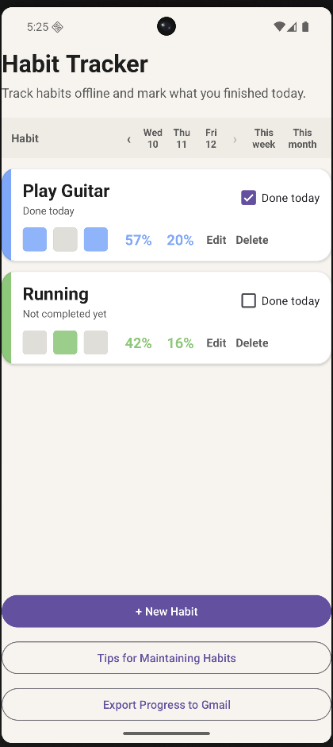
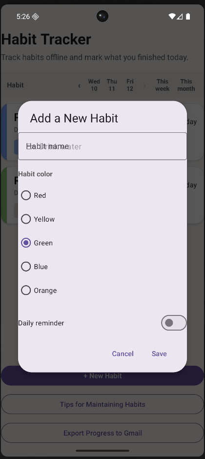
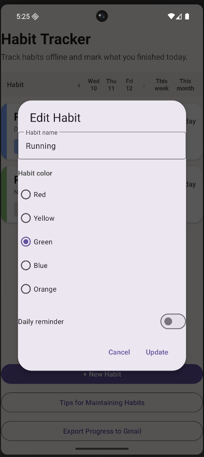
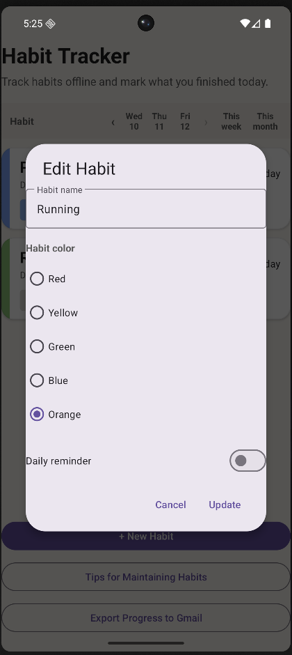
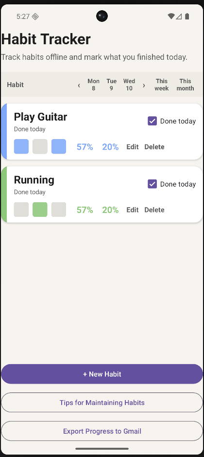
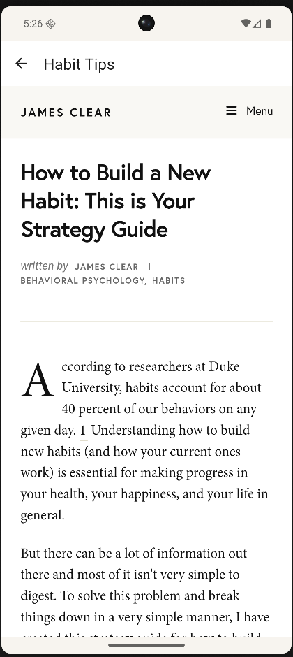
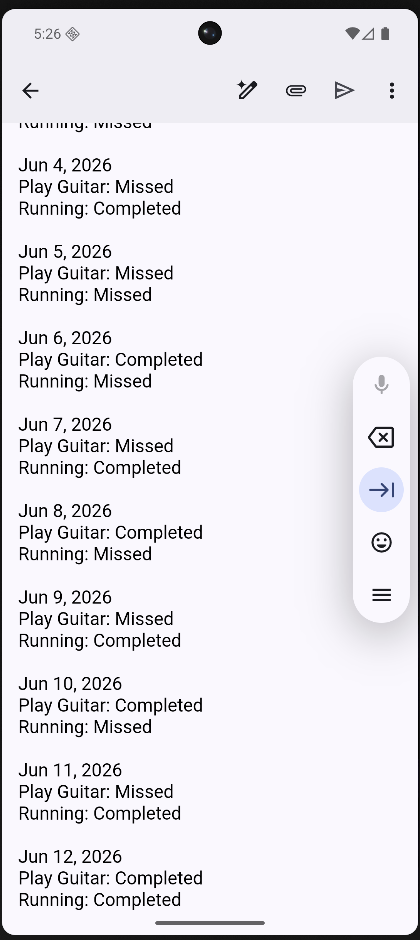

# Habit Tracker — Android App

A native Android habit-tracking app built for a Mobile App Security course. The app helps users stay accountable to their daily habits with completion tracking, historical stats, daily reminders, and progress exports — all stored privately on-device.

---

## Screenshots

<table>
  <tr>
    <td align="center" width="25%">
      <br/>
      <b>Main Screen</b><br/>
      <sub>Each habit gets its own color-coded card showing today's completion checkbox, a 3-day history strip, and weekly/monthly completion percentages.</sub>
    </td>
    <td align="center" width="25%">
      <br/>
      <b>Add a Habit</b><br/>
      <sub>Tap <em>+ New Habit</em> to name a habit, pick a color, and optionally set a daily reminder time — all in one dialog.</sub>
    </td>
    <td align="center" width="25%">
      <br/>
      <b>Edit a Habit</b><br/>
      <sub>Any habit can be updated at any time — rename it, change its color, or toggle the daily reminder on or off.</sub>
    </td>
    <td align="center" width="25%">
      <br/>
      <b>Color Customization</b><br/>
      <sub>Choose from five colors (red, yellow, green, blue, orange) to visually distinguish habits at a glance.</sub>
    </td>
  </tr>
  <tr>
    <td align="center" width="25%">
      <br/>
      <b>Marking Habits Done</b><br/>
      <sub>Check off a habit for today with a single tap. The card updates immediately and the stats recalculate in real time.</sub>
    </td>
    <td align="center" width="25%">
      <br/>
      <b>History Navigation</b><br/>
      <sub>Use the arrows (or swipe the header) to scroll back through up to 30 days of history. Colored cells show completed, missed, or pre-creation days.</sub>
    </td>
    <td align="center" width="25%">
      <br/>
      <b>Habit Tips</b><br/>
      <sub>A sandboxed WebView loads James Clear's (<em>Atomic Habits</em>) strategy guide directly in the app — JavaScript and external links disabled for security.</sub>
    </td>
    <td align="center" width="25%">
      <br/>
      <b>Export to Gmail</b><br/>
      <sub>Tap <em>Export Progress to Gmail</em> to open Gmail with a pre-filled 30-day summary — locked to Gmail only via an explicit package filter.</sub>
    </td>
  </tr>
</table>

---

## Features

### Habits List
Each habit gets its own color-coded card on the main screen showing the habit name, today's completion checkbox, a 3-day rolling history strip, and 7-day / 30-day completion percentages. Habits can be added, edited, and deleted at any time.

### Daily Reminders
Each habit can have an optional daily notification set to a custom time. The app uses `AlarmManager` and a `BroadcastReceiver` to fire reminders, and a `BootReceiver` re-schedules them automatically after a device restart.

### History & Stats
The 3-day history strip on each card is navigable — tap the arrows or swipe the header row to scroll backward through up to 30 days of history. Colored cells indicate completed, missed, or pre-creation days. The card also shows week and month completion percentages at a glance.

### Export to Gmail
A single tap on **Export Progress to Gmail** opens Gmail with a pre-filled message containing a 30-day habit summary and a day-by-day breakdown for every tracked habit. The export is locked to Gmail only via an explicit package filter to prevent accidental sharing to other apps.

### Tips for Maintaining Habits
The in-app **Tips** screen loads James Clear's (*Atomic Habits*) website in a sandboxed WebView for habit-building guidance without leaving the app.

---

## Tech Stack

| Layer | Technology |
|-------|-----------|
| Language | Kotlin |
| Min SDK | 32 (Android 12L) · Target SDK 36 |
| UI | XML layouts, RecyclerView, Material 3 components |
| Persistence | Room (SQLite) — private internal storage |
| Scheduling | AlarmManager + BroadcastReceiver |
| Build | Gradle (Kotlin DSL) |

---

## Security Design

The app was built with a **principle of least privilege** mindset as part of a course focused on mobile security:

- **Local-only storage** — all habit data is stored using Room in the app's private internal storage (`/data/data/...`), inaccessible to other apps without root.
- **No backup** — `android:allowBackup="false"` prevents habit data from being included in Android's cloud backup.
- **No cleartext traffic** — `android:usesCleartextTraffic="false"` forces all network connections over HTTPS.
- **Restricted WebView** — the Tips WebView disables JavaScript, file access, and content access, and is restricted to the intended domain only. External links do not open within the WebView.
- **Scoped Gmail export** — the `Intent.ACTION_SEND` export explicitly sets `setPackage("com.google.android.gm")`, so the progress summary can only be sent via Gmail and requires direct user action to trigger.
- **Non-exported components** — `TipsActivity` and `HabitReminderReceiver` are marked `exported="false"`. Only `BootReceiver` is exported (required to receive `BOOT_COMPLETED`), and `MainActivity` is exported as the launcher entry point.
- **Runtime notification permission** — on Android 13+, the app requests `POST_NOTIFICATIONS` at runtime only when the user enables a reminder, following the principle of requesting permissions only when needed.

### Trust Assumptions
The app assumes that Android's sandbox, private storage protections, and permission system are functioning correctly on a non-rooted device. It also trusts Gmail as a safe recipient for progress summaries and the James Clear website as a trusted resource.

---

## Project Structure

```
app/src/main/java/com/example/habittracker/
├── MainActivity.kt              # Main screen, habit list, history navigation
├── HabitAdapter.kt              # RecyclerView adapter for habit cards
├── HabitUiModel.kt              # UI data model for a single habit
├── TipsActivity.kt              # WebView screen for James Clear's tips
├── HabitReminderReceiver.kt     # BroadcastReceiver that fires habit notifications
├── HabitReminderScheduler.kt    # Schedules/cancels AlarmManager reminders
└── BootReceiver.kt              # Re-schedules reminders after device reboot
```

---

## Building & Running

1. Clone the repo and open the `banerjee-source/` directory in Android Studio.
2. Sync Gradle dependencies.
3. Run on a physical device or emulator with API level 32+.

> A pre-built APK is included as `banerjee.apk.zip` if you want to sideload directly.
